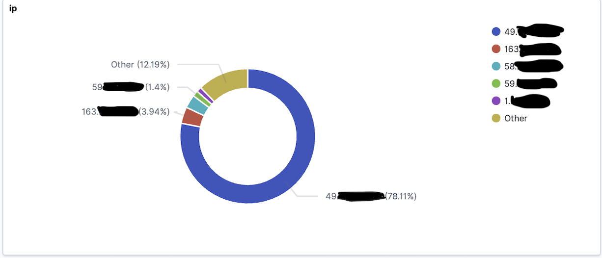
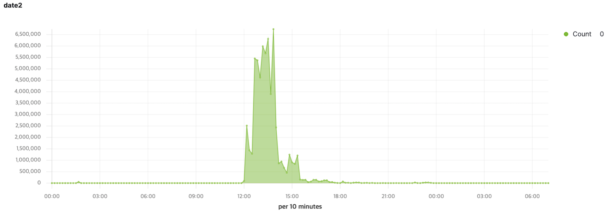

# ChristMas CTF 문제 출제 및 서버 운영 분석 후기

## 문제 출제
---
    BoB 8기가 끝나고 만들어진 bACE 사후관리 팀 활동을 하면서 몇몇 CTF 문제들을 만들었는데
    정도원 멘토님이 좋게 봐주셔서 ChristmasCTF 문제로 추천을 받아 문제를 출제하게 되었습니다. 이 글을 빌려 감사인사 드립니다.
    더불어 문제 출제와 관련해서 일정이 늦어졌음에도 도와주시고 로그 데이터 분석을 허용해주신 ChristmasCTF 운영진 여러분께도 감사드립니다.

### 첫 문제 후기
---
    어렸을때 CTF 참여만 많이 했지 문제는 몇번 풀어보지도 못한 놈이 이젠 문제를 만들고 
    있다는 아이러니한 상황에 문제 만들면서 혼자 많이 웃었습니다 ㅋㅋㅋ

### 문제점 
---
    일단 난생 처음 CTF 문제를 만들어본 탓에 서버 운영 및 문제 검수등 다방면에 부족한 점을 드러냈습니다.. 
    특히나 한동안 개발만 한 덕에 취약점 체크에 둔감해져서 처음 제 의도와 다르게 Path Traversal 취약점이 발생하여 참여한 해커들이 모두 이 취약점을 이용해서 문제를 해결했다고 합니다. (ㅠㅠ)
    두번째론 서버 운영의 미숙함이 다소 있었습니다. 서버 자체는 많이 운영해 봤지만 CTF 서버의 트래픽을 난 생 처음 경험해봤습니다. 트래픽 예측 실패로 인해 CTF 운영에 지장을 드린점 사과드립니다.

### 문제 출제시 주의 할 점 
---
    1. 취약점 검수는 확실히 할 것 (제작자가 의도한 취약점만을 이용해서 exploit 가능한지)
   
    2. 트래픽은 당신의 상상 이상이다 (기껏해야 몇명이 수동으로 하겠지 생각했는데 문제 공개와 동시에 닥치고 공격툴 부터 돌립니다....)

    3. 후반부엔 트래픽이 급감소한다 (문제 포기하는 사람들이 늘어나서인걸로 추정)

    4. 로깅 및 모니터링 시스템을 구축 할것 (눈으로 엑세스 로그 보고 수동 백업하는건 굉장히 힘듭니다.)

    5. 가능하면 Auto Scalling 이 가능하도록 구축할것 (고성능이 필요한건 처음 몇시간 동안만 입니다.)

## 서버 운영

### 로그 쌓은 썰 
---
    일단 모니터링을 한걸 보면 시작과 동시에 보통 취약점 점검 툴을 돌리는걸로 보였습니다.
    1. 범용 툴로 점검
    2. 취약점 가능 spot 탐지 및 서버 관련 정보 수집
    3. 취약해보이는데에 수동으로 exploit 시작 ??? 

    이런 프로세스로 진행하는걸로 보였습니다. (3번은 예측입니다.)

    여러분의 열화와 같은 성원에 힘입어 공격툴로 서버를 고문한덕에 3시간치 로그가 유실되었음에도 불구하고 15시간만에 21G의 로그, 61000만건 이상의 악성 엑세스 로그 데이터가 쌓였습니다. ㅎㅎㅎ 덕분에 분석에 잘 활용 했습니다.

### 분석 후기 
---

    맥북 : 난 인권도 없냐? 씨X

    이걸 맥북으로 분석 하려고 한건 패착이었던거 같습니다. 
    6100만건의 엑세스 로그를 맥에다가 올리니까 도커가 램을 15G를 넘게 먹더라구요... 
    ElasticSearch에 로그 넣는데에만 4시간 가까이 걸렸습니다.
    여러분 이래서 맥은 32G를 사야 합니다.

    해커들의 실제 공격 패턴을 볼 수 있는 재밌는 경험이었던거 같습니다. 그리고 해커 여러분의
    변태같은 OS취향을 엿볼수 있었던 시간이었습니다.
    

### Kibana Dashboard
---

### Agent 비율 
---

전체 트래픽의 90% 이상이 사람이 아닌 source로 접속하셨더군요.

번외로 삼성 모바일 브라우저를 이용해 접속하셨던 분도 계시더군요

90%가 임의로 생성된 트래픽이란게 증명되었습니다.

### 공격 페이로드 

### 전체 네트워크 트래픽
---

 ### 1804.48948 MB
웹 사이트 특성상 파일 크기가 큰게 없음에도 불구하고 상당히 많은 트래픽이었습니다.

### IP 분포도
---

개인정보보호를 위해 ip는 일부 블러 처리하였습니다. 

49.X IP분은 아주 열성적으로 문제에 관심을 주셨더라구요.

한분이 홀로 전체 요청량의 77%를 혼자 차지하셔서 트래픽 1등을 달성하셨습니다!!!

### 시간대별 요청량
---

12시가 넘어 문제가 공개되자마자 올라가는 트래픽이 보이시죠?

그때부터 서버는 살려달라고 비명을 외치고 있었습니다....

12시부터 2시까지의 트래픽이 전체 트래픽의 70% 이상을 차지했습니다 ㅎㅎ

### OS
---

해커들 답게 OS도 아주 다양하게 쓰시더군요 

윈도우, 맥, Ubuntu까진 흔하지만 Solaris라니...?  

서버로도 요새 많이 안쓰는 OS를 사용하신다니 Respect...

대체 어떤 데스크톱 환경에서 해킹을 하신 건지 재밌는 분석 결과입니다.

### 서버 스펙 
---
* MEM : 15G
* CPU : Intel (R) Xeon Gold 5120 CPU @ 2.2GHz (processer : 6, cache : 2G)
* HDD : 37G
* OS : Ubuntu 18.04.5 LTS

### Network 트래픽 
---
* 순간 최고 분당 40MB
* 평균 분당 8MB

### CPU
---
* 순간 최고 점유율 96% (nginx-django-db 이렇게 도커가 구성되었는데 nginx는 30%이하로 멀쩡 했습니다. Django가 무겁긴 하더군요)
* 평균 점유율 : 40%
